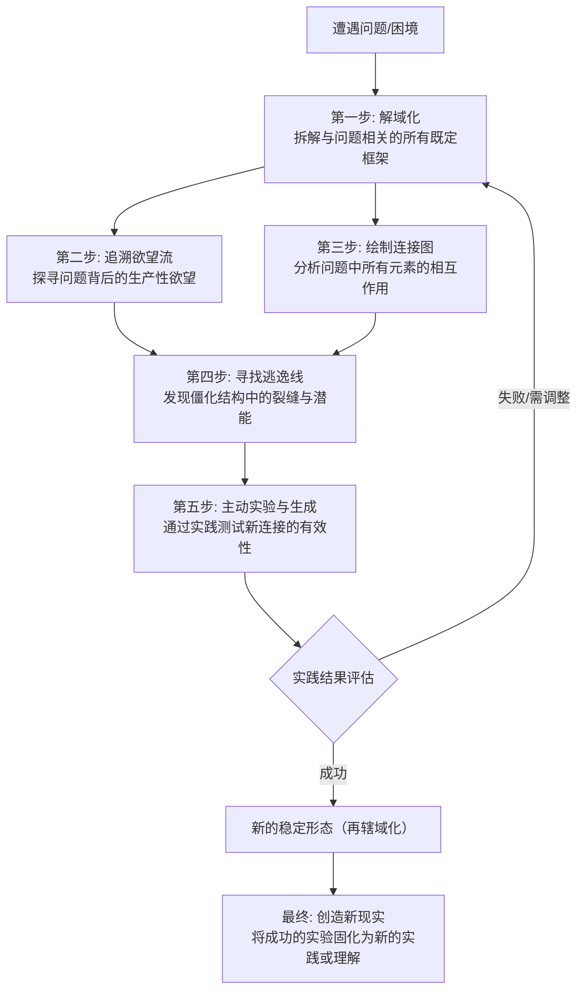

应用德勒兹的生成哲学来思考问题，意味着进行一场彻底的思维革命。这绝非简单地“使用”一个理论，而是**启动一种“生成-德勒兹式”的思考过程**。

以下是一套可操作的方法论指南，当您面对任何问题（无论是哲学、艺术、社会议题还是个人困境）时，可以尝试遵循以下步骤：

### **应用德勒兹生成哲学的思考流程**

为了更直观地展现这一过程，下图描绘了从打破既定认知到主动创造现实的完整思维路径：

### **第一步：解域化 (Deterritorialize) —— 拆解“既定框架”**

*   **行动**：立即暂停所有想当然的预设和二元对立标签。将问题中所有看似稳固的**名词**（身份、概念、结构）都视为**动词**和**过程**。
*   **自问**：
    *   *这个问题中，哪些东西被看作是“理所当然”的？（例如：“公司就应该有 hierarchy”、“一幅画就应该是美的”）*
    *   *我用了哪些二元对立来框定这个问题？（例如：成功/失败、理性/感性、自然/文化）如何能打破这些对立？*
    *   *与这个问题相关的“标准答案”或“普遍看法”是什么？我如何能暂时悬置它们？*

### **第二步：追溯“欲望流”而非“缺失”**

*   **行动**：拒绝从“问题”或“缺失”的角度思考。转而分析：**这里的欲望正在生产什么？它想要连接什么？它试图创造什么？**
*   **自问**：
    *   *驱动这个问题中所有行动者的**生产性欲望**是什么？（不是他们“缺少”什么，而是他们正在“创造”什么现实？）*
    *   *这股欲望流目前是如何被**引导、封锁或扭曲**的？*
    *   *如果抛开一切目标，纯粹的**内在动力**是什么？*

### **第三步：绘制“连接图”与“聚合体”**

*   **行动**：不要分析“是什么”（事物），而是分析 **“它和什么连接？如何连接？”**（关系）。将问题视为一个由人、物、概念、机构、情感等各种异质元素动态构成的 **“聚合体”**。
*   **自问**：
    *   *这个问题涉及哪些**异质性元素**？（例如：在一次社会运动中，涉及参与者、口号、社交媒体平台、警察、法律、恐惧情绪、历史记忆……）*
    *   *这些元素之间目前是如何**连接和互动的**？*
    *   *这个聚合体的功能是什么？它在**生产什么**？（生产顺从？生产反抗？生产焦虑？生产新的知识？）*

### **第四步：寻找“逃逸线”**

*   **行动**：在现有的聚合体中，敏锐地发现那些**无法被完全编码、正在流动、溢出或断裂的线索**。这就是改变的潜能所在。
*   **自问**：
    *   *当前系统（聚合体）的**裂缝**在哪里？哪些规则被悄悄打破？哪些地方存在“灰色地带”？*
    *   *有没有一些**微小的实践、另类的想法或被边缘化的元素**，蕴含着不同的可能性？*
    *   *如果我想让这个系统**变形或崩溃**，从哪里入手最可能？*

### **第五步：主动实验——“生成-X”**

*   **行动**：这是最关键的一步。停止纯粹的分析，开始**思考和实践一种“生成”**。主动制造新的连接，尝试新的组合。
*   **自问**：
    *   *我如何能**引入一个新的元素**，来打破现有的平衡？（例如：在思考教育问题时，引入“生成-游戏”的概念）*
    *   *我能否**与一个看似不相关的事物建立连接**，从而产生新的视角？（例如：将城市规划问题与“生成-森林”连接思考）*
    *   *我可以进行一个怎样的**微小实践**（一个行动、一次对话、一个创作），来测试一种新的可能性？*

### **第六步：评估标准：“是增强还是削弱生命力？”**

*   **行动**：放弃“对/错”或“真/假”的判断标准。采用德勒兹的**伦理标准**：这个想法或实践，是**增强还是削弱了生命的力量**？
*   **自问**：
    *   *这个新连接、新生成，是打开了新的可能性，还是封闭了可能性？*
    *   *它是让我们感到更自由、更充盈、更具创造力，还是更压抑、更僵化、更停滞？*
    *   *它是否创造了新的感受、新的情感、新的思考方式？*

---

### **一个简单的应用案例：思考“职业倦怠”**

1.  **解域化**：拒绝“懒惰”、“不敬业”、“需要休息”这些既定标签。将“职业”本身看作一个欲望流动的场域。
2.  **追溯欲望流**：倦怠不是“缺失”了动力，而是欲望正在生产别的东西！也许它生产的是对单调重复的抗拒，生产的是对另一种生活方式的渴望。
3.  **绘制聚合体**：分析“我-工作”这个聚合体：连接了薪资、同事、通勤、KPI、自我期待、社会观念……这些元素如何互动？目前在生产焦虑和疲惫。
4.  **寻找逃逸线**：发现哪些元素可以改变？是否可以重新定义“成功”？是否可以在工作中偷偷进行一个有趣的小项目（逃逸线）？
5.  **主动实验**：**生成-业余艺术家**。每周拿出两小时，不做任何计划地乱画、写作或做音乐，纯粹为了实验的快乐。将这个实践引入生活。
6.  **评估**：这个“生成-艺术家”的实践是否让你对工作日有了不同的感受？是否注入了一丝新的活力（即使微小）？如果是，就继续并强化这个连接。

**最终，应用德勒兹哲学思考，就是从“这是什么？”的考古学家，转变为“这能变成什么？”的创造者或地图绘制师。** 它要求我们永远保持开放，永远愿意尝试新的连接，并在此过程中，不断地重新创造自己和世界。